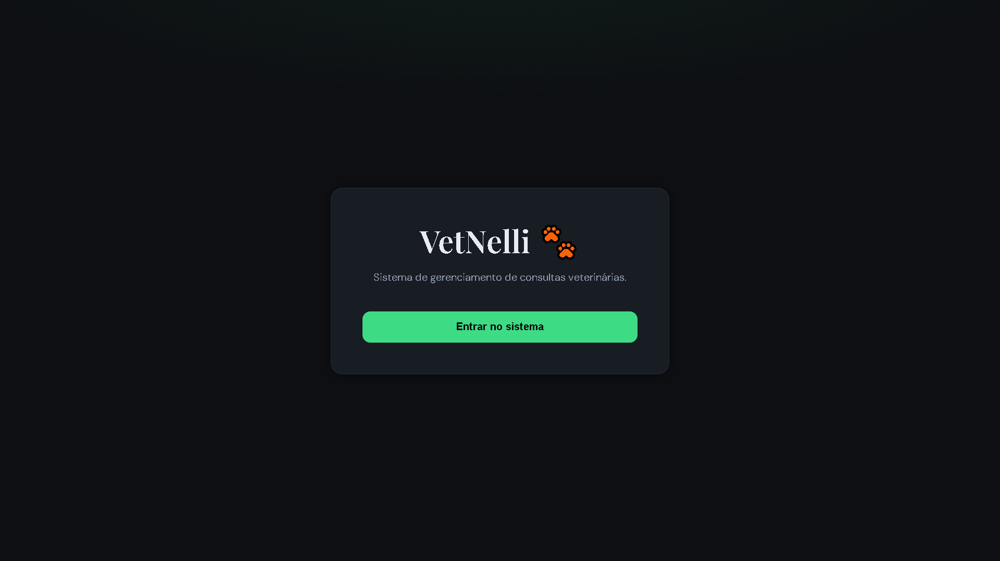
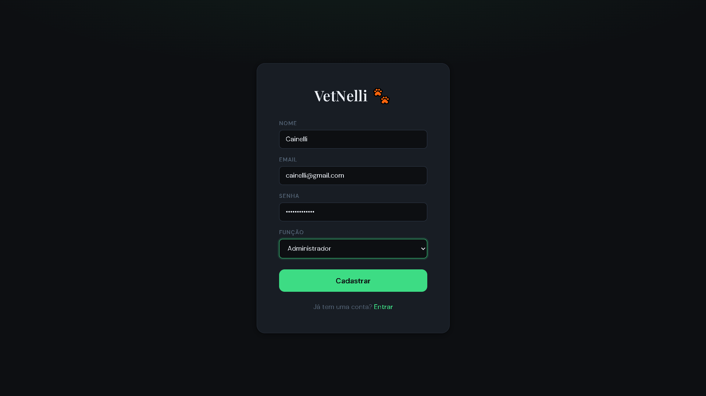
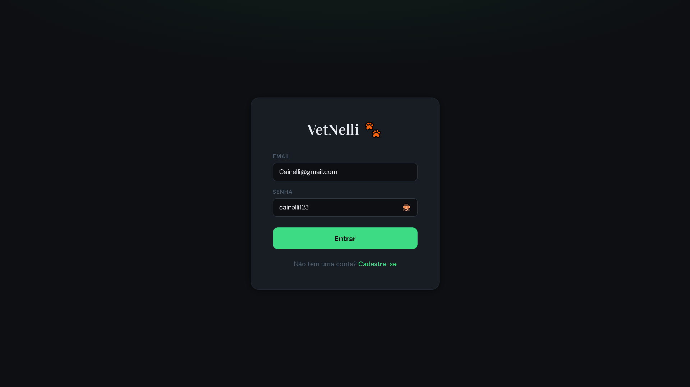
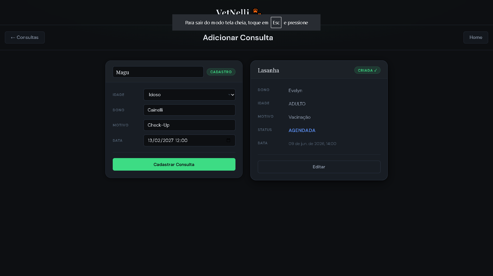
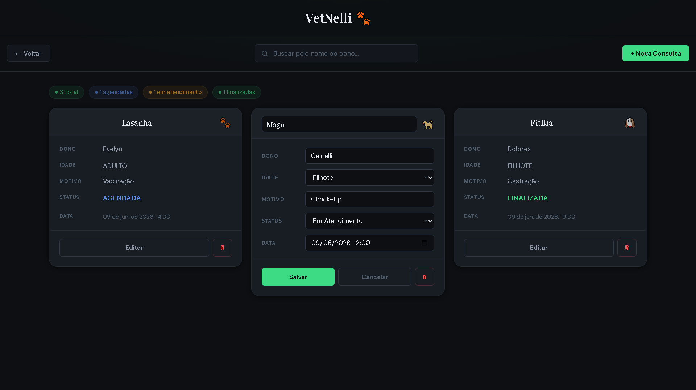
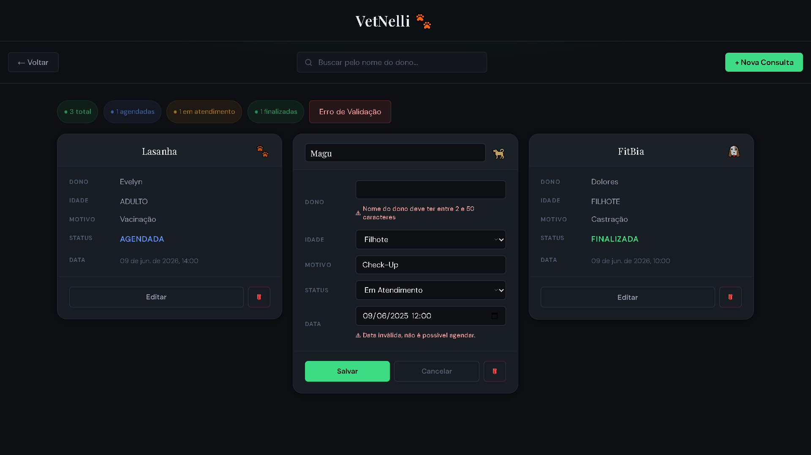

# VetNelli Frontend 🐾

Sistema web para gerenciamento de consultas veterinárias desenvolvido com React.

## 🚀 Tecnologias Utilizadas

* React
* React Router DOM
* Axios
* CSS3
* Vite

## ⚙️ Funcionalidades

### Autenticação
* Cadastro de usuários
* Login com JWT

### Consultas
* Cadastro, listagem, edição e exclusão
* Atualização de status
* Busca por nome do dono

### Geral
* Validação de formulários
* Tratamento de erros da API
* Interface responsiva

<h2>📸 Screenshots</h2>

<h3>Home</h3>
<p align="center">
  
</p>


<h3>Cadastro Usuário</h3>
<p align="center">
  
</p>


<h3>Login</h3>
<p align="center">
  
</p>


<h3>Cadastro de Consulta</h3>
<p align="center">
  
</p>

<h3>Gerenciamento de Consultas</h3>
<p align="center">
  
</p>

<h3>Validação de Campos</h3>
<p align="center">
  
</p>

## 📁 Estrutura do Projeto

```text
src
├── components
├── pages
├── services
└── auth
├── css
├── App.jsx
└── main.jsx
```

## Arquitetura do Projeto

Esta aplicação utiliza uma API REST desenvolvida separadamente em Spring Boot.

🔗 Backend: https://github.com/GiovanniCainelli/vet-Nelli-API

Principais operações disponíveis:

* Autenticação JWT com SpringBoot
* Validação utilizando tokens
* Criar consultas
* Buscar consultas
* Atualizar consultas
* Alterar status das consultas
* Excluir consultas
* Receber mensagens de validação e erros da API


## ⚙️ Configuração

Crie um arquivo `.env` na raiz do projeto:

```env
VITE_API_URL=http://localhost:8080
```

## ▶️ Como Executar

Clone o projeto:

```bash
git clone https://github.com/GiovanniCainelli/vetnelli-frontend.git
```

Entre na pasta:

```bash
cd vetnelli-frontend
```

Instale as dependências:

```bash
npm install
```

Execute a aplicação:

```bash
npm run dev
```

A aplicação estará disponível em:

```text
http://localhost:5173
```

## 🎯 Próximas Melhorias
* Painel Administrativo de Usuários
* Dashboard com métricas
* Deploy da aplicação
* Testes automatizados

## 👨‍💻 Autor

Desenvolvido por **Giovanni Cainelli**

* Estudante de Análise e Desenvolvimento de Sistemas
* Desenvolvedor Java e React
